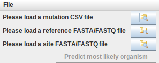
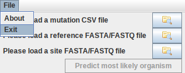

# Aufgabe zu Woche 6

In dieser Woche implementieren Sie die Berechnung des wahrscheinlichsten Organismus in einem Datensatz sowie die Grundzüge des GUI.

## Vorhersage des wahrscheinlichsten Organismus

Auf Basis der eingelesenen Daten können Sie nun für die unterschiedlichen Organismen die Wahrscheinlichkeit ermitteln, dass die Probe von ihnen stammt.

Dafür kann es unterschiedliche Herangehensweisen geben. Klar ist aber, dass in allen Fällen eine Liste von GS-Scores für die unterschiedlichen Organismen berechnet werden muss und daraus ableitend der wahrscheinlichste Organismus berechnet werden muss. 

### SequenceAnalysis

Implementieren Sie entsprechend zunächst eine abstrakte Klasse ```SequenceAnalysis``` mit den folgenden Methoden:

* ```public SequenceAnalysis(String reference, SequenceFile sequences, MutationFile mutations)```: Constructor, der die für die Berechnung relevanten Informationen entgegennimmt. 
* ```public abstract void calculateErrorOdds()```: Eine abstrakte Methode für die tatsächliche Berechnung der Fehlerwahrscheinlichkeit pro Organismus. Diese Methode ist abstrakt, weil die konkrete Implementation je nach verwendeter Methode unterschiedlich sein kann.
* ```public HashMap<String, Double> getErrorOdds()```: Gibt die berechneten Fehlerwahrscheinlichkeiten zurück. Falls die Fehlerwahrscheinlichkeiten noch nicht berechnet wurden, führt diese Methode zuallererst die Berechnung durch. 
* ```public String getMostLikelyOrganism()```: Gibt den Namen des wahrscheinlichsten Organismus zurück. Es ist immer der Organismus mit der geringsten Fehlerwahrscheinlichkeit. Haben mehrere Organismen die gleiche Fehlerwahrscheinlichkeit (z.B. wenn gar keine Mutationen gefunden wurden und die Fehlerwahrscheinlichkeit daher für alle Organismen 1 ist) wird irgendeiner dieser Organismen zurückgegeben. Falls die Fehlerwahrscheinlichkeiten noch nicht berechnet wurden, führt diese Methode zuallererst die Berechnung durch. 
* ```public String getOrganismDescriptions()```: Listet die Organismen mit ihren Fehlerwahrscheinlichkeiten in Textform auf (z.B. zeilenweise "Organismenname: Fehlerwahrscheinlichkeit"). Falls die Fehlerwahrscheinlichkeiten noch nicht berechnet wurden, führt diese Methode zuallererst die Berechnung durch.

### FullLengthSequenceAnalysis

Eine Variante, die Fehlerwahrscheinlichkeiten vorherzusagen, ist zu überprüfen, ob exakt die mit einem GS-Score assoziierte Sequenze in dem Datensatz vorhanden sind. Es muss also für jede mit einem GS-Score assoziierte Sequenz überprüft werden, ob diese in dem Datensatz vorhanden ist. Falls ja, werden die damit assoziierten Fehlerwahrscheinlichkeiten aus den GS-Scores für alle Organismen berechnet und mit den für diesen Organismus bisher berechneten Fehlerwahrscheinlichkeiten multipliziert (siehe Beschreibung aus Woche 1). Die Start-Fehlerwahrscheinlichkeit für jeden Organismus ist 1 (also sozusagen 100%).  

Zunächst müssen Sie dafür aber in der Lage sein, aus der Beschreibung der Mutation (z.B. 90M) und der Referenzsequenz die mutierte Sequenz herzuleiten. Implementieren Sie also 
* In ```Mutation``` eine Methode ```public String getSequence(String reference)```, die die von der Mutation vorhergesagte Veränderung der Referenzsequenz zurückgibt. Ist die Mutation beispielsweise ```2A,4Y```, sollte ```getSequence("MLKRL"")``` zurückgeben ```MAKYL``` (die 2. Aminosäure wurde durch ein A, die 4. durch ein Y ersetzt). Hinweis: Sie können das Parsen des Mutationsstrings selber implementieren, oder Sie können das Regular Expression-Modul von Java verwenden, insbesondere die Klassen ```Pattern``` sowie ```Matcher``` mit der Methode ```find``` könnten hilfreich sein, eine Beschreibung der Funktionsweise finden Sie z.B. [hier](https://www.tutorialspoint.com/javaregex/javaregex_capturing_groups.htm). 
* In ```SequenceFile``` eine Methode ```public boolean containsSequence(String sequence)```, die true zurückgibt, wenn die übergebene Sequenz in dem SequenceFile vorhanden ist, und sonst false. Dank der Verwendung von ```HashSet``` zum Speichern der Sequenzen in ```SequenceFile``` können Sie das effizient machen, ohne über alle Sequenzen zu iterieren. 

Implementieren Sie dann eine Klasse `FullLengthSequenceAnalysis`, die von `SequenceAnalysis` ableitet und die abstrakten Methoden implementiert. Bedenken Sie dabei, dass die Formel für die Berechnung der Fehlerwahrscheinlichkeit aus dem GS-Score (siehe 1. Woche) wie folgt ist:


## GUI

Nachdem Sie nun die Fehlerwahrscheinlichkeiten vorhersagen können, ist es an der Zeit, die Nutzung für nicht-Informatik-affine Personen einfacher zu machen. Dafür implementieren Sie die ersten Elemente eines GUI. Das GUI soll angezeigt werden, falls das Programm ohne irgendwelche Argumente aufgerufen wird, wie es z.B. bei einem Start durch Doppelklick auf das Programmsymbol der Fall wäre - passen Sie die ```main``` in ```SequenceAnalysis``` entsprechend an.

Implementieren Sie zudem eine Klasse ```SequenceAnalysisGUI``` in dem package ```org.htw.prog2.aufgabe1```, welche von ```JFrame``` ableitet und das folgende Fenster erstellt:



Das Menü "File" soll die zwei Einträge "About" und "Exit" enthalten:



Neben den Grundlagen aus dem Skript benötigen Sie dafür ein ```JMenu``` mit ```JMenuItems``` - die Verwendung finden Sie auf dieser [Dokumentations-Seite von Oracle](https://docs.oracle.com/javase/tutorial/uiswing/components/menu.html#create) beschrieben. Sie können für diesen Teil der Aufgabe alles auf dieser Seite außer dem Bereich "Creating Menus" ignorieren, mit event handling setzen wir uns in der nächsten Woche auseinander.

Für die Bilder auf den Buttons können sie ein ```javax.swing.ImageIcon``` verwenden, welches im Constructor eine png-Datei nimmt. Die im Beispielscreenshot verwendete Datei finden Sie im repository unter resources/folder_explore.png, sie stammt aus dem für offene Software beliebten [silk iconset von famfamfam](http://www.famfamfam.com/lab/icons/silk/). Das ```ImageIcon``` können Sie dann anstelle eines Textes an den Constructor von ```JButton``` übergeben.

Leider sind automatisierte Tests von Java-GUIs, insbesondere in Umgebungen ohne grafisches System wie die ubuntu-Images auf github, fehleranfällig. Um zu vermeiden, dass in der Hälfte der Fälle die Tests bei Ihnen fehlschlagen, verzichte ich bei der GUI auf automatisierte Tests. Ersetzen Sie bitte stattdessen die Datei Bilder/Aufgabe4_screenshot.png durch einen Screenshot Ihrer GUI, dieser erscheint in dieser REAMDE.md dann hier:


